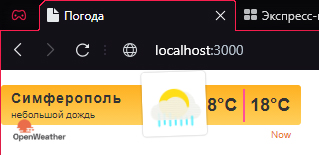
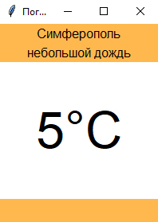

<p align="center">МИНИСТЕРСТВО НАУКИ  И ВЫСШЕГО ОБРАЗОВАНИЯ РОССИЙСКОЙ ФЕДЕРАЦИИ<br>
Федеральное государственное автономное образовательное учреждение высшего образования<br>
"КРЫМСКИЙ ФЕДЕРАЛЬНЫЙ УНИВЕРСИТЕТ им. В. И. ВЕРНАДСКОГО"<br>
ФИЗИКО-ТЕХНИЧЕСКИЙ ИНСТИТУТ<br>
Кафедра компьютерной инженерии и моделирования</p>
<br>
<h3 align="center">Отчёт по лабораторной работе № X<br> по дисциплине "Программирование"</h3>
<br><br>
<p>студента 1 курса группы ПИ-б-о-201(2)<br>
Петросян Армен Хачатурович<br>
направления подготовки 09.03.04 "Название направления подготовки"</p>
<br><br>
<table>
<tr><td>Научный руководитель<br> старший преподаватель кафедры<br> компьютерной инженерии и моделирования</td>
<td>(оценка)</td>
<td>Чабанов В.В.</td>
</tr>
</table>
<br><br>
<p align="center">Симферополь, 2020</p>
<hr>

## Постановка задачи

Разработать сервис предоставляющий данные о погоде в городе Симферополе на момент запроса. В качестве источника данных о погоде используйте: http://openweathermap.org/. В состав сервиса входит: серверное приложение на языке С++ и клиентское приложение на языке Python.

Серверное приложение (далее Сервер) предназначенное для обслуживания клиентских приложений и минимизации количества запросов к сервису openweathermap.org. Сервер должен обеспечивать возможность получения данных в формате JSON и виде html виджета (для вставки виджета на страницу будет использоваться iframe).

Клиентское приложение должно иметь графический интерфейс отображающий сведения о погоде и возможность обновления данных по требованию пользователя.

## Цель работы

- Закрепить навыки работы с json
- Закрепить навыки работы с многофайловыми приложениями
- Получить базовое представление о взаимодействии приложений посредством создания клиент-сервеного приложения
- Получение знаний о структуре html запроса

## Выполнение работы

##### Подготовка перед создание программы

1. Регистрируемся на сервисе openweathermap.org и получаем API-key.
<details>
  <summary>Мой API-key</summary>

  ```
  ff1484a9c853eaf0e82bdeee8b3cae19
  ```
</details>

2. Составим запрос, соответствующий указанниям в тз (Составьте запрос на получение прогноза погоды для Симферополя с почасовым интервалом, в градусах Цельсия, на русском языке)
<details>
  <summary>Мой запрос</summary>

  ```
  http://api.openweathermap.org/data/2.5/onecall?id=524901&appid=ff1484a9c853eaf0e82bdeee8b3cae19&lang=ru&units=metric&lat=44.95719&lon=34.11079&exclude=current,minutely,daily,alerts
  ```
</details>

3. Составляем запрос для получения времени в Симферополе
<details>
<summary>Мой запрос</summary>

  ```
http://worldtimeapi.org/api/timezone/Europe/Simferopol
  ```
</details>

4.  ### Создание сервера

Создаём серверное приложение. Сервер слушает get запросы на 3000 порт localhost. При определенном запросе он выдает либо html-виджет, либо обработанный json, который он получил с openweathermap и обработал. Данные хранятся в кэше, который обновляется, при устаревании.

<details>

```C++
#define _CRT_SECURE_NO_WARNINGS
#include <iostream>
#include <string>
#include <fstream>
#include <chrono>
#include <iomanip>
#include <json/json.hpp>
#include <cpp_httplib/httplib.h>

using json = nlohmann::json;
using namespace httplib;

std::string html_str;


void json_init(const Result& res, json& new_json)
{
    if (res)
    {
        if (res->status == 200)
            new_json = json::parse(res->body);
        else
            std::cout << "Status code: " << res->status << std::endl;
    }
    else
    {
        auto err = res.error();
        std::cout << "Error code: " << err << std::endl;
    }
}

std::string current_time_str()
{
    auto current_time = std::chrono::system_clock::now();

    std::time_t current_time_t = std::chrono::system_clock::to_time_t(current_time);
    std::string date_new;
    date_new = ctime(&current_time_t);

    std::string time_now;
    if (date_new[11] != '0')
        time_now += date_new[11];
    time_now += date_new[12];
    return time_now;
}

int current_time_int()
{
    auto current_time = std::chrono::system_clock::now();

    std::time_t current_time_t = std::chrono::system_clock::to_time_t(current_time);
    std::string date_new;
    date_new = ctime(&current_time_t);

    std::string time_now;
    if (date_new[11] != '0')
        time_now += date_new[11];
    time_now += date_new[12];

    return atoi(time_now.c_str());
}

void html_editing(std::string& html_str, const std::string& raw_arg, const std::string& arg)
{
    size_t position = html_str.find(raw_arg);
    while (position != std::string::npos)
    {
        html_str.replace(position, raw_arg.size(), arg);
        position = html_str.find(raw_arg, position + arg.size());
    }
}

void gen_response(const Request& req, Response& res) 
{
    html_editing(html_str, "{hourly[i].temp}", current_time_str());

    json tmp;
    std::fstream cache("cache.txt");

    if (!cache.is_open())
        std::cerr << "Error!\nFile not open\n";
    else
        cache >> tmp;

    std::string description_raw = tmp[current_time_int()]["description"].dump();
    
    std::string description;
    for (int i = 0; i < description_raw.size(); i++)
        if (description_raw[i] != char(34) && description_raw[i] != '\\')
            description += description_raw[i];

    html_editing(html_str, "{hourly[i].weather[0].description}", description);

    std::string icon_raw = tmp[current_time_int()]["icon"].dump();
    std::string icon;
    for (int i = 0; i < icon_raw.size(); i++)
        if (icon_raw[i] != char(34) && icon_raw[i] != '\\')
            icon += icon_raw[i];

    html_editing(html_str, "{hourly[i].weather[0].icon}", icon);
  
    cache.close();
    res.set_content(html_str, "text/html;charset=utf-8");
}

void gen_response_raw(const Request& req, Response& res) 
{
    std::fstream cache("cache.txt");
    std::string rawR;
    if (cache.is_open())
        getline(cache, rawR, '\0');
    else
    {
        std::cerr << "Error!\nFile not open\n";
        return;
    }
    std::string raw;
    for (int i = 0; i < rawR.length(); i++)
    {
        if (rawR[i] == '\\')
        {
            i++;
            continue;
        }
        raw += rawR[i];
    }

    res.set_content(raw, "text/plain;charset=utf-8");
}

int main() {
    Server svr;
    

    Client openweather_cli("http://api.openweathermap.org");
    auto openweather_res = openweather_cli.Get("/data/2.5/onecall?id=524901&appid=ff1484a9c853eaf0e82bdeee8b3cae19&lang=ru&units=metric&lat=44.95719&lon=34.11079&exclude=current,minutely,daily,alerts");

    json openweather_json;
    json_init(openweather_res, openweather_json);
 
    Client worldtime_cli("http://worldtimeapi.org");
    auto worldtime_res = worldtime_cli.Get("/api/timezone/Europe/Simferopol");
    
    json worldtime_json;
    json_init(worldtime_res, worldtime_json);
  
    json tmp = json::array();

    json* tmp_arr = new json[48];

    for (int i = 0; i < 48; i++)
    {
        tmp_arr[i]["time"] = i;
        tmp_arr[i]["temp"] = (int)openweather_json["hourly"][i]["temp"];
        std::string  description  = openweather_json["hourly"][i]["weather"][0]["description"].dump();
        std::string icon = openweather_json["hourly"][i]["weather"][0]["icon"].dump();
        tmp_arr[i]["icon"] = icon;
        tmp_arr[i]["description"] = description;
        tmp[i] = tmp_arr[i];
    }

    delete[] tmp_arr;
    
    std::string cache_str = tmp.dump();
    std::ofstream cache("cache.txt");

    if (!cache.is_open())
        std::cerr << "Error!\nFile not open\n";
    else
        cache << cache_str;
    cache.close();

    std::ifstream html_file("widget.html");

    if (html_file.is_open())
        getline(html_file, html_str, '\0');
    else    
        std::cerr << "Error!\nFile not open\n";

    html_file.close();


    svr.Get("/", gen_response);
    svr.Get("/raw", gen_response_raw);

    std::cout << "\nStart server... OK\n";
    svr.listen("localhost", 3000);
    return 0;
}
```
</details>

5.  ### Создание клиентского приложения
Создаём клиентское приложение, которое будет посылать запросы на наш локальный сервер при помощи "requests", обрабатывать json файл с помощью модуля "json" и отображать погоду на текущий момент при помощи "Tkinter". Приложение создается на python с использованием библиотеки tkinter. 

<details>


```python
from tkinter import *
import requests
import json
import datetime


def refresh(event=None):
    try:
        res = requests.get('http://localhost:3000/raw').content.decode("utf8")
        data = json.loads(res)

        current_time = datetime.datetime.now().hour
        description.config(text=str(data[current_time]["description"]))
        temp.config(text=str((data[current_time]["temp"])) + "°C")
    except requests.exceptions.ConnectionError:
        pass


root = Tk()
root.title("Погода")
root.pack_propagate(0)
root.bind("<Button-1>", refresh)
root.geometry("200x250")


top_frame = Frame(root, bg="#ffb84d", width=100, height=30)
top_frame.pack(side=TOP, fill=X)

middle_frame = Frame(root, bg="#ffffff",  width=100, height=30*3)
middle_frame.pack(expand=True, fill=BOTH)

bottom_frame = Frame(root, bg="#ffb84d", width=100, height=30)
bottom_frame.pack(side=BOTTOM, fill=X)


city = Label(top_frame, font=("Arial Bold", 12), text="Симферополь", bg="#ffb84d")
description = Label(top_frame, font=("Arial", 12), bg="#ffb84d")
temp = Label(middle_frame, font=("Arial Bold", 48), bg="#ffffff")

city.pack(pady=0)
description.pack(pady=0)
temp.pack(expand=True)

refresh()
root.mainloop()

```
</details>
<br>


6. ### Внешний вид HTML-виджета и python-приложения
 
 
<center></center>
<center>*рис. 1 html-виджет*</center>

<center></center>
<center>*рис. 2 клиентское приложение*</center>

## Вывод

В процессе выполнения работы я закрепил свои навыки работы с json, получил представление об обратной стороне клиент-серверного приложения, закрепил свои знания о структуре http запроса.