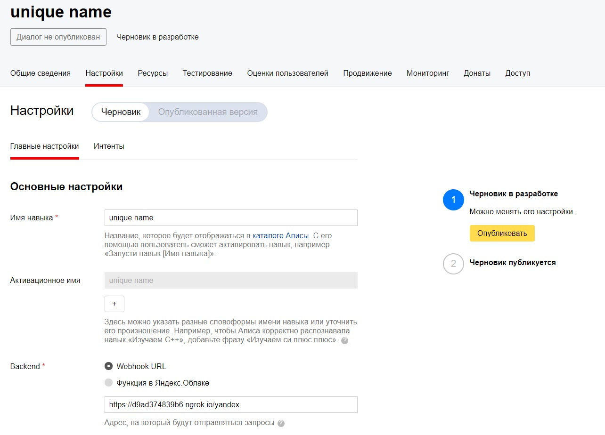
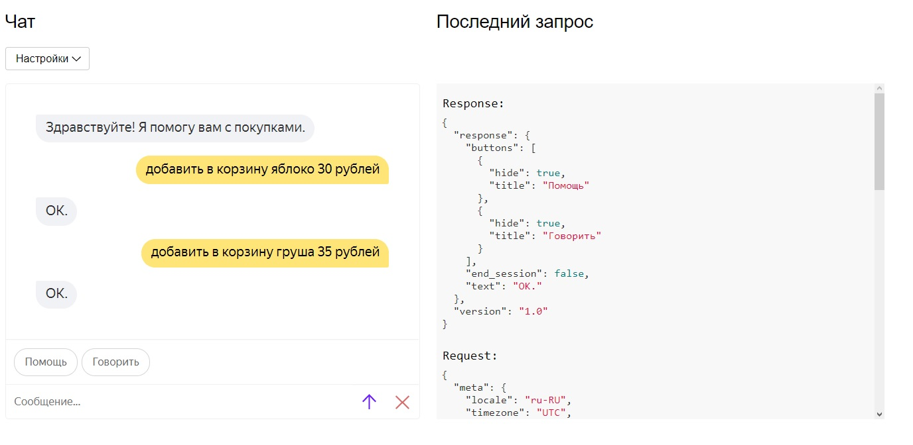
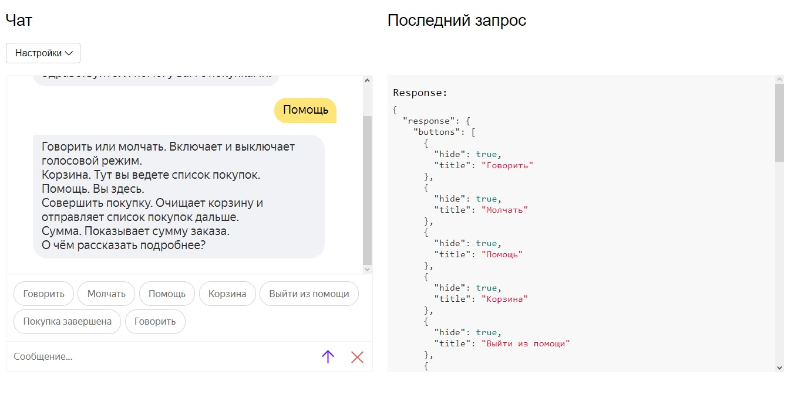

<p align="center">МИНИСТЕРСТВО НАУКИ  И ВЫСШЕГО ОБРАЗОВАНИЯ РОССИЙСКОЙ ФЕДЕРАЦИИ<br>
Федеральное государственное автономное образовательное учреждение высшего образования<br>
"КРЫМСКИЙ ФЕДЕРАЛЬНЫЙ УНИВЕРСИТЕТ им. В. И. ВЕРНАДСКОГО"<br>
ФИЗИКО-ТЕХНИЧЕСКИЙ ИНСТИТУТ<br>
Кафедра компьютерной инженерии и моделирования</p>
<br>
<h3 align="center">Отчёт по лабораторной работе № 2<br> по дисциплине "Программирование"</h3>

<br><br>

<p>студента 1 курса группы ПИ-б-о-201(2)<br>
Петросяна Армена Хачатуровича<br>
направления подготовки 09.03.04 "Программная инженерия"</p>


<br><br>
<table>
<tr><td>Научный руководитель<br> старший преподаватель кафедры<br> компьютерной инженерии и моделирования</td>
<td>(оценка)</td>
<td>Чабанов В.В.</td>
</tr>
</table>
<br><br>

<p align="center">Симферополь, 2020</p>
<hr>

## Постановка задачи

1. Разработайте и зарегистрируйте навык для Алисы на сервисе Яндекс.Диалоги

2. В качестве backend-a для навыка реализуйте приложение на языке С++ выполняющее следующие функции:

    1. Составление продуктовой корзины:

        - Добавление продукта в корзину;
        - Удаление продукта из корзины;
        - Очистка корзины;
        - Вывод списка товаров в корзине;
        - Подсчёт стоимости товаров в корзине.

    2. Вывод справочной информации по навыку;

    3. Регистрацию webhook-ов сторонних сервисов;

    4. Отправку данных на сторонние сервисы. 

3. В качестве стороннего сервиса реализуйте приложение на языке Python выполняющее следующие функции:

    1. Ожидание данных о покупке;
    2. Сохранение поступивших данных в excel-документ.

## Цель работы

- Получить представления о структуре post-запроса;
- Изучить webhooks на практике;

## Выполнение работы

#### Подготовка к созданию программы

1. Изучаем информацию о post-запросах
2. Изучаем информацию о вебхуках

#### Создание серверного приложения

Создаём серверное приложение. Он генерирует сайт с вебхуками. Сервер "слушает" get и post запросы, приходящие на `localhost` порт `1234` и записывает данные в json. При получении post-запроса сервер смотрит, какой запрос пришёл и поплняет либо иссякает вебхук.


*Рисунок 1. Страница с вебхуками*

Далее мы регистрируем навйк в Алисе. Далее представлен с криншот с моими настройками:


*Рисунок 2. Настройки Алисы*

Демонстрация работы функционала Корзина:



*Рисунок 3. Демонстрация работы корзины*

Демонстрация работы функционала Помощь:



*Рисунок 4. Демонстрация работы помощи*

Скриншот страницы управления webhook-ами с добавленным webhook-ом клиентского приложения:


*Рисунок 3. Демонстрация работы серверного сайта с добавленными webhooks*

Ссылка на excel-файл заполненный клиентским приложением.

*link*


Полный исходный код серверного приложения

<details>
<summary>Исходный код</summary>

```c++
#include <iostream>
#include <fstream>
#include <vector>

#include <cpp_httplib/httplib.h>
#include <json/json.hpp>

using json = nlohmann::json;
using namespace httplib;

json dataJson;

std::ifstream logger("log.txt");

// Server

void replace_all(std::string& html_str, const std::string& raw_arg, const std::string& arg)
{
	size_t position = html_str.find(raw_arg);
	while (position != std::string::npos)
	{
		html_str.replace(position, raw_arg.size(), arg);
		position = html_str.find(raw_arg, position + arg.size());
	}
}

json set_data()
{
	std::ifstream data_file("data.json");
	json dataJsonTmp;
	if (data_file.is_open())
	{
		data_file >> dataJsonTmp;
		data_file.close();
	}
	else
	{
		json data;
		data["webhooks"] = json::array();
		return data;
	}
	return dataJsonTmp;
}

std::string returnHtmlStr()
{
	std::ifstream html("webhooks.html");
	std::string htmlStr;
	if (html.is_open())
	{
		std::getline(html, htmlStr, '\0');
		html.close();
	}
	else
	{
		return "";
	}

	std::string webhook_list;

	if (!dataJson["webhooks"].empty())
	{
		std::string tmp = R"(
<div class="form-row align-items-center">
    <div class="col">
        <input type="text" value="{Webhook URL}" class="form-control mb-2" disabled>
    </div>

    <div class="col">
        <button type="submit" name="del" value="{Webhook URL}" class="btn btn-danger mb-2">Удалить</button>
    </div>
</div>)";

		for (auto webhookTmp : dataJson["webhooks"])
		{
			if (webhookTmp.is_string())
			{
				replace_all(tmp, "{Webhook URL}", webhookTmp.get<std::string>());
				webhook_list += tmp;
			}
		}
	}
	replace_all(htmlStr, "{webhooks_list}", webhook_list);
	return htmlStr;
}

void gen_response_get(const Request& req, Response& res)
{
	res.set_content(returnHtmlStr(), "text/html; charset=UTF-8");
}

void data_preservation(json config)
{
	std::ofstream data_file("data.json");

	data_file << config.dump(4);
	data_file.close();
}

void gen_response_post(const Request& req, Response& res)
{


	if (req.has_param("set"))
	{
		std::string param_value = req.get_param_value("set");
		if (param_value != "")
		{
			if (!dataJson["webhooks"].empty())
			{
				bool webhook_exist = false;
				for (auto i = dataJson["webhooks"].begin();	i != dataJson["webhooks"].end(); i++)
				{
					if (i->get<std::string>() == param_value && i->is_string())
					{
						webhook_exist = true;
						break;
					}
				}
				if (!webhook_exist) {
					dataJson["webhooks"].push_back(param_value);
				}
			}
			else
			{
				dataJson["webhooks"].push_back(param_value);
			}
		}
	}
	if (req.has_param("del"))
	{
		std::string param_value = req.get_param_value("del");
		if (param_value != "")
		{
			if (!dataJson["webhooks"].empty())
			{
				for (auto i = dataJson["webhooks"].begin(); i != dataJson["webhooks"].end(); i++)
				{
					if (i->is_string() && i->get<std::string>() == param_value)
					{
						dataJson["webhooks"].erase(i);
						break;
					}
				}
			}
		}
	}
	data_preservation(dataJson);

	res.set_content(returnHtmlStr(), "text/html; charset=UTF-8");
}

// Yandex

enum speaking_mode
{
	to_be_silent,
	talk
};
enum mode
{
	def,
	help
};

json default_buttons =
{
	{
		{"title", "Помощь"},
		{"hide", true}
	},
};
json talk_button =
{
	{"title", "Говорить"},
	{"hide", true}
};
json to_be_silent_button =
{
	{"title", "Молчать"},
	{"hide", true}
};

json help_buttons =
{
	{
		{"title", "Говорить"},
		{"hide", true}
	},
	{
		{"title", "Молчать"},
		{"hide", true}
	},
	{
		{"title", "Помощь"},
		{"hide", true}
	},
	{
		{"title", "Корзина"},
		{"hide", true}
	},
	{
		{"title", "Выйти из помощи"},
		{"hide", true}
	},
	{
		{"title", "Покупка завершена"},
		{"hide", true}
	},
};

json session_list = json::array();

json gen_response(std::string text, std::string tts, json buttons, json* current_session = nullptr, bool end_session = false)
{
	json response = {
		{"response", {
			{"buttons", buttons},
			{"end_session", end_session}
		}},
		{"version", "1.0"}
	};

	if (text != "")
	{
		response["response"]["text"] = text;
	}
	
	if (current_session != nullptr && (*current_session)["voice_mode"] == talk)
	{
		if (tts != "")
		{
			response["response"]["tts"] = tts;
		}

		response["response"]["buttons"].push_back(to_be_silent_button);
	}
	else if (current_session != nullptr && (*current_session)["voice_mode"] == to_be_silent)
	{
		response["response"]["buttons"].push_back(talk_button);
	}

	return response;
}

void yandex(const Request& req, Response& res)
{
	json reqJson = json::parse(req.body);

	std::string user_id = reqJson["session"]["application"]["application_id"];
	json response;
	json* current_session = nullptr;

	for (auto& session : session_list)
	{
		if (session["user_id"] == user_id)
		{
			current_session = &session;
			break;
		}
	}

	if (reqJson["session"]["new"].get<bool>())
	{
		if (current_session != nullptr)
		{
			(*current_session)["skill_mode"] = def;
			(*current_session)["voice_mode"] = to_be_silent;
		}
		else
		{
			json session =
			{
				{"user_id", user_id},
				{"skill_mode", def},
				{"voice_mode", to_be_silent},
				{"cart", json::array()}
			};
			
			session_list.push_back(session);
			current_session = &session_list[session_list.size() - 1];
		}

		json response = gen_response("Здравствуйте! Я помогу вам с покупками.", "Здр+авствуйте! Я помог+у вам с пок+упками.", default_buttons, current_session);

		res.set_content(response.dump(2), "text/json; charset=UTF-8");
		return;
	}

	if (current_session == nullptr)
	{
		json response = gen_response("Извините, произошла ошибка", "Извин+ите, произошл+а ош+ибка", default_buttons, current_session, true);
		
		res.set_content(response.dump(2), "text/json; charset=UTF-8");
		return;
	}

	std::string command = reqJson["request"]["command"];
	if ((*current_session)["skill_mode"] == help)
	{
		std::string text;
		std::string tts;

		if (command == "молчать")
		{
			text = "Скажите мне молчать и я буду молчать.";
			tts = "Скаж+ите мне эту молч+ать и я б+уду молч+ать.";
		}
		else if (command == "говорить")
		{
			text = "Скажите мне говорить и я буду говорить";
			tts = "Скаж+ите мне говор+ить и я буду говор+ить";
		}
		else if (command == "помощь")
		{
			text = "Вы находитесь здесь. ";
			tts = "Вы нах+одитесь здесь. ";
		}
		else if (command == "корзина")
		{
			text = "Я запоминаю, что вы сохраняете и удалаяете из корзины.\n"
				"Для добавления достаточно сказать: \"Добавить в корзину \"название товара\" \"цена\" рублей\".\n"
				"Для удаления скажите: \"Удалить из корзины \"название товара\"\".";
			tts = "Я запомин+аю, что вы сохран+яете и удала+яете из корз+ины.\n"
				"Для добавл+ения дост+аточно сказ+ать: Доб+авить в корзину, название товара и цену в рублях.\n"
				"Для удал+ения скаж+ите: Удал+ить из корз+ины, назв+ание тов+ара и ц+ену в рубл+ях.";
		}
		else if (command == "покупка завершена")
		{
			text = "Если вы выбрали хотя бы один товар, я передам список покупок дальше.";
			tts = "+Если вы в+ыбрали хот+я бы один тов+ар, я перед+ам сп+исок пок+упок д+альше.";
		}
		else if (command == "выйти из помощи")
		{
			text = "Обращайся ещё.";
			tts = "Обращ+айся ещ+ё.";
			(*current_session)["skill_mode"] = def;
		}
		else if (command == "сумма")
		{
			text = "Я подсчитаю и скажу стоимость всей корзины.";
			tts = "Я подсчит+аю и скажу ст+оимость всей корз+ины.";
		}
		else
		{
			text = "К сожалению, меня еще не всему обучили. Я не знаю, что мне делать";
			tts = "К сожал+ению, мен+я еще не всем+у обуч+или. Я не знаю, что мне д+елать";
		}

		json response;
		if ((*current_session)["skill_mode"] == help)
		{
			response = gen_response(text, tts, help_buttons, current_session);
		}
		else
		{
			response = gen_response(text, tts, default_buttons, current_session);
		}
		res.set_content(response.dump(2), "text/json; charset=UTF-8");
	}
	else
	{
		if (command == "молчать")
		{
			std::string text = "Молчу, молчу";
			std::string tts;
			
			(*current_session)["voice_mode"] = to_be_silent;

			json response = gen_response(text, tts, default_buttons, current_session);
			res.set_content(response.dump(2), "text/json; charset=UTF-8");
		}
		else if (command == "говорить")
		{
			std::string text = "Хорошо.";
			std::string tts = "Хорош+о.";

			(*current_session)["voice_mode"] = talk;
			
			json response = gen_response(text, tts, default_buttons, current_session);
			res.set_content(response.dump(2), "text/json; charset=UTF-8");
		}
		else if (command == "помощь")
		{
			std::string text =
				"Говорить или молчать. Включает и выключает голосовой режим.\n"
				"Корзина. Тут вы ведете список покупок.\n"
				"Помощь. Вы здесь. \n"
				"Совершить покупку. Очищает корзину и отправляет список покупок дальше.\n"
				"Сумма. Показывает сумму заказа.\n"
				"О чём рассказать подробнее?";
			std::string tts =
				"Говор+ить или молч+ать. Включ+ает и выключ+ает голосов+ой реж+им.\n"
				"Корз+ина. Тут вы вед+ете сп+исок поку+пок.\n"
				"П+омощь. Вы здесь. \n"
				"Соверш+ить пок+упку. Очищ+ает корз+ину и отправл+яет сп+исок пок+упок д+альше.\n"
				"С+умма. Пок+азывает с+умму зак+аза.\n"
				"О чём рассказ+ать подр+обнее?";

			json response = gen_response(text, tts, help_buttons, current_session);

			(*current_session)["skill_mode"] = help;

			res.set_content(response.dump(2), "text/json; charset=UTF-8");
		}
		else if (command == "очистить корзину")
		{
			std::string text = "Корзина пуста.";
			std::string tts = "Кориз+ина пуст+а.";

			json response = gen_response(text, tts, default_buttons, current_session);

			(*current_session).erase("cart");
			(*current_session)["cart"] = json::array();
			
			res.set_content(response.dump(2), "text/json; charset=UTF-8");
		}
		else if (command == "что в корзине")
		{
			std::string text;
			std::string tts;

			if ((*current_session)["cart"].empty())
			{
				std::string text = "Корзина пуста.";
				std::string tts = "Кориз+ина пуст+а.";
			}
			else
			{
				text = "На данный момент в вашей корзине:\n";
				for (auto& elem : (*current_session)["cart"])
				{
					int price = elem["price"].get<int>();

					text += elem["item"].get<std::string>() + " в цену " + std::to_string(price);

					if (price % 10 == 0)
					{
						text += " рублей,";
					}
					else if (price % 10 == 1)
					{
						text += " рубль,";
					}
					else if (price % 10 < 5 && price % 10 > 0)
					{
						text += " рубля,";
					}
					else
					{
						text += " рублей,";
					}
				}

				text.pop_back();
				tts = text;
			}

			json response = gen_response(text, tts, default_buttons, current_session);
			res.set_content(response.dump(2), "text/json; charset=UTF-8");
		}
		else if (command == "покупка завершена")
		{
			std::string text = "Заходите ещё!";
			std::string tts = "Заход+ите ещ+ё!";

			json output =
			{
				{"user_id", user_id},
				{"cart", (*current_session)["cart"]}
			};

			json dataTmp = set_data();

			for (std::string link : dataTmp["webhooks"])
			{
				// https не работает, заменяем на http
				replace_all(link, "https://", "http://");

				// "http://" length
				const int http_length = 7;

				int i = link.find('/', http_length);

				if (i == std::string::npos)
				{
					link.push_back('/');
				}

				//Client cli("webhook.site");
				//cli.Post("/03bc9f3d-f956-466d-8af9-ccd922c65da2", output.dump(2), "application/json; charset=UTF-8");
				json response = gen_response(text, tts, default_buttons, current_session, true);
				res.set_content(response.dump(2), "text/json; charset=UTF-8");
			}

			(*current_session).erase("cart");
			(*current_session)["cart"] = json::array();

			json response = gen_response(text, tts, default_buttons, current_session, true);
			res.set_content(response.dump(2), "text/json; charset=UTF-8");
		}
		else if (command == "сумма")
		{
			std::string text;
			std::string tts;

			auto size = reqJson["request"]["nlu"]["tokens"].size();
			int sum = 0;
			for (auto& cart_item : (*current_session)["cart"])
			{
				sum += cart_item["price"].get<int>();
			}
			if (sum == 0)
			{
				text = "У вас в корзине нет товаров.";
				tts = "У вас в корз+ине нет тов+аров.";
			}
			else
			{
				text = "Сумма покупки равна " + std::to_string(sum);
				tts = "С+умма пок+упки равн+а " + std::to_string(sum);
				if (sum % 10 == 0)
				{
					text += " рублей.";
					tts += " рубл+ей.";
				}
				else if (sum % 10 == 1)
				{
					text += " рубль.";
					tts += " рубль.";
				}
				else if (sum % 10 < 5 && sum % 10 > 0)
				{
					text += " рубля.";
					tts += " рубл+я.";
				}
				else
				{
					text += " рублей.";
					tts += " рубл+ей.";
				}
			}

			json response = gen_response(text, tts, default_buttons, current_session);
			res.set_content(response.dump(2), "text/json; charset=UTF-8");
		}
		else if (command.find("добавить в корзину") == 0 || command.find("добавь в корзину") == 0)
		{
			auto size = reqJson["request"]["nlu"]["tokens"].size();

			std::string text = "ОК.";
			std::string tts = "Ок+ей.";
			
			std::string name;

			int price = 0;
			int	index = 0;
			bool index_set = false;

			for (auto object : reqJson["request"]["nlu"]["entities"])
			{
				if (object["type"].get<std::string>() == "YANDEX.NUMBER")
				{
					index = object["tokens"]["start"];
			
					int val = object["value"];
					if (val < 0)
					{
						text = "Цена не может быть отрицательной.";
						tts = "Цен+а не м+ожет б+ыть отриц+ательной.";
					}
					else if (val == 0)
					{
						text = "И это все бесплатно?";
						tts = "И это все беспл+атно?";
					}
					else
					{
						price = val;
					}

					index_set = true;
					break;
				}
			}
			if (size == 3)
			{
				text = "Что добавить в корзину.";
				tts = "Что доб+авить в корз+ину.";
			}
			else if (!index_set)
			{
				text = "Укажите цену товара.";
				tts = "Укаж+ите ц+ену тов+ара.";
			}
			else if (index == 3)
			{
				text = "Укажите название товара.";
				tts = "Укаж+ите назв+ание тов+ара.";
			}
			else
			{
				for (int i = 3; i < index; ++i)
				{
					name += reqJson["request"]["nlu"]["tokens"][i].get<std::string>();
					name += " ";
				}
				name.pop_back();
				json item = {
					{"item",  name},
					{"price", price}
				};
				(*current_session)["cart"].push_back(item);
			}

			json response = gen_response(text, tts, default_buttons, current_session);

			res.set_content(response.dump(2), "text/json; charset=UTF-8");
		}
		else if (command.find("удалить из корзины") == 0 || command.find("удали из корзины") == 0
			|| command.find("убрать из корзины") == 0 || command.find("убери из корзины") == 0)
		{
			auto size = reqJson["request"]["nlu"]["tokens"].size();

			std::string text;
			std::string tts;

			std::string name;

			for (int i = 3; i < size; ++i)
			{
				name += reqJson["request"]["nlu"]["tokens"][i].get<std::string>();
				name += " ";
			}
			bool item_found = false;
			int	item_index = 0;

			if (name == "")
			{
				text = "Скажите, что убирать.";
				tts = "Скаж+ите, что убир+ать.";
			}
			else
			{
				name.pop_back();
				for (auto& cart_item : (*current_session)["cart"])
				{
					if (cart_item["item"].get<std::string>() == name)
					{
						item_found = true;
						break;
					}
					++item_index;
				}
				if (!item_found)
				{
					text = "Не нашла";
					tts = "Не нашл+а.";
				}
				else
				{
					text = "Удалила.";
					tts = "Удал+ила";
					(*current_session)["cart"].erase((*current_session)["cart"].begin() + item_index);
				}
			}

			json response = gen_response(text, tts, default_buttons, current_session);
			res.set_content(response.dump(2), "text/json; charset=UTF-8");
		}
		else
		{
			std::string text = "Я не знаю такую команду.";
			std::string tts = "Я не зн+аю так+ую ком+анду.";

			json response = gen_response(text, tts, default_buttons, current_session);

			res.set_content(response.dump(2), "text/json; charset=UTF-8");
		}
	}
}
int main()
{
	if (dataJson.empty())
		dataJson = set_data();

	Server srv;

	srv.Get("/webhooks", gen_response_get);
	srv.Post("/webhooks", gen_response_post);

	/*Client cli("http://webhook.site");
	auto res = cli.Post("/03bc9f3d-f956-466d-8af9-ccd922c65da2", dataJson.dump(), "text/json");

	if (res) {
		if (res->status == 200) {
			std::cout << res->body << std::endl;
		}
		else {
			std::cout << "Status code: " << res->status << std::endl;
		}
	}
	else {
		auto err = res.error();
		std::cout << "Error code: " << err << std::endl;
	}*/

	srv.Post("/yandex", yandex);

	srv.listen("localhost", 1234);

}
```
</details>

<br>

Полный исходный код клиентского приложения

<details>
<summary>Исходный код</summary>

```python
from flask import Flask, request
import json
import datetime
import openpyxl
import os.path

app = Flask(__name__)


def write_xls():
    global max_line, buff

    book = openpyxl.load_workbook('data.xlsx')
    sheet = book.active

    for raw in buff:
        for i in range(5):
            sheet.cell(max_line, i + 1).value = raw[i]
        max_line += 1

    book.save('data.xlsx')
    book.close

    buff.clear()


@app.route('/', methods=['POST'])
def index():
    global buff, max_id
    req_json = request.get_json()
    req_time = datetime.datetime.now().time()

    for it in req_json['cart']:
        raw = [max_id, req_json['user_id'], req_time, it['item'], it['price']]
        max_id += 1

        buff.append(raw)

    if len(buff) > 0:
        write_xls()

    return '0'


if __name__ == "__main__":
    global buff, max_id, max_line
    buff = []
    max_id = 1
    max_line = 2


if not os.path.exists('data.xlsx'):
    book = openpyxl.Workbook()
    sheet = book.active

    sheet['A1'].value = 'N'
    sheet['B1'].value = 'User ID'
    sheet['C1'].value = 'Datetime'
    sheet['D1'].value = 'Item'
    sheet['E1'].value = 'Prise'

    book.save('data.xlsx')
    book.close


app.run()


```
</details>


## Вывод

В ходе выполнения лабораторной работы мы научились:

- Работать с webhooks
- Работать с post-запросами
- Создавать собственные навыки в алисе
- Работать с библиотекой Flask на python
- Работать с excel на python