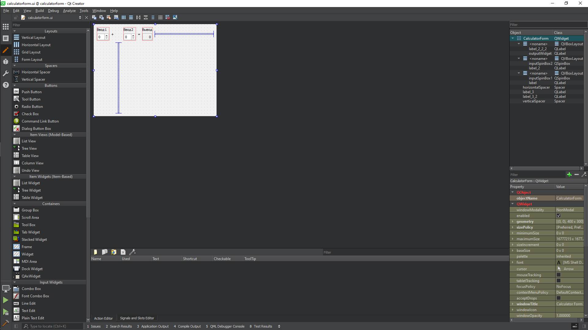
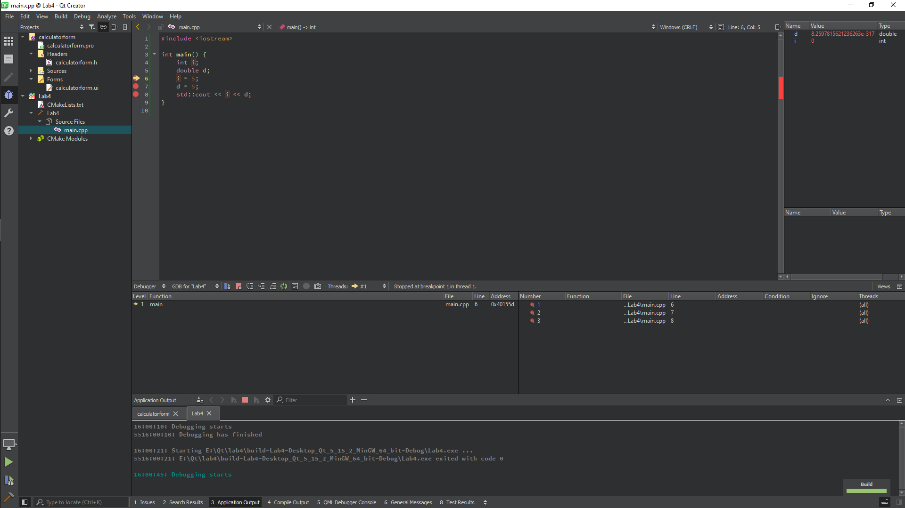

<p align="center">МИНИСТЕРСТВО НАУКИ  И ВЫСШЕГО ОБРАЗОВАНИЯ РОССИЙСКОЙ ФЕДЕРАЦИИ<br>
Федеральное государственное автономное образовательное учреждение высшего образования<br>
"КРЫМСКИЙ ФЕДЕРАЛЬНЫЙ УНИВЕРСИТЕТ им. В. И. ВЕРНАДСКОГО"<br>
ФИЗИКО-ТЕХНИЧЕСКИЙ ИНСТИТУТ<br>
Кафедра компьютерной инженерии и моделирования</p>
<br>
<h3 align="center">Отчёт по лабораторной работе № 4<br> по дисциплине "Программирование"</h3>

<br><br>

<p>студента 1 курса группы ПИ-б-о-201(2)<br>
Петросяна Армена Хачатуровича<br>
направления подготовки 09.03.04 "Программная инженерия"</p>

<br><br>
<table>
<tr><td>Научный руководитель<br> старший преподаватель кафедры<br> компьютерной инженерии и моделирования</td>
<td>(оценка)</td>
<td>Чабанов В.В.</td>
</tr>
</table>
<br><br>

<p align="center">Симферополь, 2020</p>
<hr>

## Постановка задачи

Настроить рабочее окружение, для разработки программного обеспечения при помощи Qt и IDE Qt Creator, а также изучить базовые возможности данного фреймворка.

## Цель работы

1. Установить фреймворк Qt

2. Изучить основные возможности создания и отладки программ в IDE Qt Creator

## Выполнение работы

### Установка и проверка на работоспособность

Скачаем QT с официального сайта, согласно методичке

Для проверки работоспособности в разделе **примеры** найдем проект **Calculator Form Example**. После ознакомления с документацией создадим проект с нужными параметрами.
После создания в каталоке **Формы** откроем главную форму проекта и заменим текст "Input 1", "Input 2", "Output" на "Ввод 1", "Ввод 2" и "Вывод".



*Рисунок 1. Редактор формы QT*

### Ответы на вопросы

1. Как изменить цветовую схему (оформление) среды?

Tools/Options/Enviroment/Interface

2. Как закомментировать/раскомментировать блок кода средствами Qt Creator? Имеется ввиду комбинация клавиш или пункт меню.

Выбрать нужную строку либо выделить нужный блок кода и использовать комбинацию клавиш **Ctrl+/**

3. Как открыть в проводнике Windows папку с проектом средствами Qt Creator?

File/Open File or Project

4. Какое расширение файла-проекта используется Qt Creator? Может быть несколько ответов.

.pro .txt

5. Как запустить код без отладки?

**Ctrl+R**

6. Как запустить код в режиме отладки?

**F5**

7. Как установить/убрать точку останова (breakpoint)?

**F9**

### Работа в QT

1. Создайте консольное приложение

2. Заменим содержимое файла main.cpp на:

```c++
#include <iostream>
 
int main() {
    int i;
    double d;
    i = 5;
    d = 5;
    std::cout << i << d;
}
```

3. Переключим режим сборки в режим Отладка

4. Установим точки останова на 6, 7, 8 строках

5. Выполним программу в режиме отладки



*Рисунок 2. Работа в режиме отладки в QT*

**Ответы на вопросы**

- В 6 строке значения переменных равны: d(double) = 3.7590886e-317; i(int) = 0

- В 7 строке значения переменных равны: d(double) = 3.7590886e-317; i(int) = 5

- В 8 строке значения переменных равны: d(double) = 5; i(int) = 0

## Вывод

В ходе выполнения лабораторной работы я научился:

- Устанавливать среду разработки **Open Source Qt**
- Работать со средой разработки
- Настраивать среду разработки